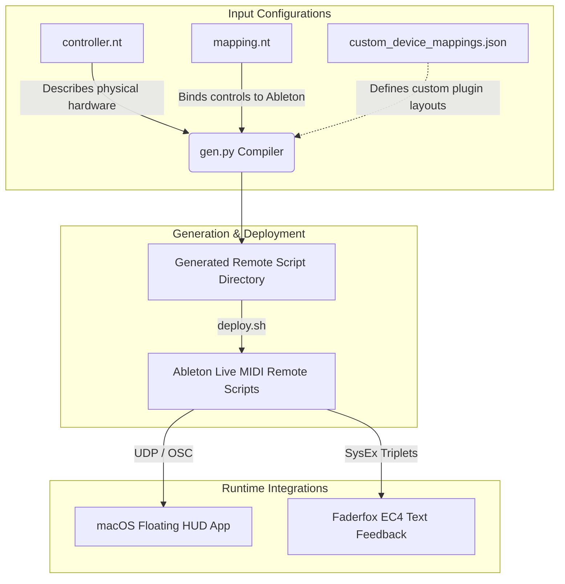

# Ableton Control Surface as Code (Midi-Device-Mapper-for-Ableton-Live)
## Comprehensive User Manual

Welcome to the **Ableton Control Surface as Code** system (also known as the *MIDI Device Mapper for Ableton Live*). This framework allows you to generate custom Ableton MIDI Remote Scripts using clean, simple configurations in NestedText (`.nt` or `.yaml`) files. You can map encoders, buttons, and faders to mixer tracks, transport controls, devices, and custom Python functions—**without writing Python code**.

Furthermore, it integrates with a **native macOS floating Heads-Up Display (HUD)** and provides physical **character SysEx feedback** for hardware controllers like the Faderfox EC4.

---

## Architecture & System Overview

The system compiles text configs into Python control surface scripts that Ableton can load natively:



### Core Design Philosophy
*   **Creativity Loves Speed**: Designed for tech-focused users and power musicians who want to configure and iterate on control surfaces quickly.
*   **Stable Overlays**: The HUD keeps you grounded in what parameter you are actually adjusting, updating dynamically as you select different tracks and devices.
*   **Zero Ableton Restarts**: The custom reloading socket lets you apply mapping edits instantly while Ableton is running.

---

## Installation & Prerequisites

1.  **Ableton Live**: Compatible with Ableton Live 10, 11, and 12 (Suite/Standard).
2.  **Python 3**: Ensure Python 3.9+ is installed and available in your shell path.
3.  **Dependencies**: Run the following from the root directory to install necessary parser libraries:
    ```bash
    poetry install
    ```
    *Or if using raw pip:*
    ```bash
    pip install -r requirements.txt
    ```

---

## 1. Physical Controller Setup (`controller.nt`)

The controller configuration describes the physical hardware's knobs, buttons, and sliders. Typically placed in `live_surfaces/<controller-name>/controller_<name>.nt`.

### Configuration Structure
```nt
# Defines if encoders map absolute MIDI CC values (0-127) or relative values
encoder-mode: absolute

# Colors for controllers supporting LED midi feedback
light_colors:
    off: 12
    red_low: 13
    green_full: 60
    amber: 17

# List of rows, columns, or groups of controls
control_groups:
    -
        layout: row
        number: 1
        type: knob
        midi_channel: 3
        midi_type: CC
        midi_range: 21-28
    -
        layout: row
        number: 2
        type: knob
        midi_channel: 3
        midi_type: CC
        midi_range: 29, 42, 43, 44, 45, 46, 47, 48
        under: 1
    -
        layout: row
        number: 3
        type: button
        midi_channel: 9
        midi_type: note
        midi_range: A-2, C-1, CS1, D1, C1, C3, F1, G1
        under: 2
    -
        layout: row
        number: 4
        type: button
        midi_channel: 3
        midi_type: CC
        midi_range: 114, 115
        right_of: 2
        hud: false
```

### Attribute Reference
*   **`encoder-mode`**: Set to `absolute` (default) or `relative`.
*   **`light_colors`**: Name-to-integer mapping for LED midi output.
*   **`layout`**: Position declaration. Usually `row` or `row-part`.
*   **`number`**: The row (or column) number starting at 1.
*   **`type`**: Must be `knob`, `button`, or `slider`.
*   **`midi_channel`**: MIDI channel (1-16) the controls emit on.
*   **`midi_type`**: `CC` (Control Change) or `note`.
*   **`midi_range`**: Can be defined as ranges (`21-28`), comma-separated numbers (`114, 115`), or MIDI note names (`C-1, C1, CS1, C3`).
*   **`under` / `right_of`**: Optional placement decorators relative to other group numbers to help the compiler build visual representation parameters.
*   **`hud`**: Set to `false` to prevent this group from rendering on the floating HUD overlay.

---

## 2. Ableton Mapping Setup (`mapping.nt`)

The mapping file references the controller configuration and links physical coordinates to Ableton actions. For full schema details, see [mapping_file.md](file:///Users/ck/current/ableton_control_suface_as_code/docs/mapping_file.md).

```nt
controller: controller_lc.nt
ableton_dir: /Applications/Ableton Live 12 Suite.app
parameter_mappings_file: ../../data/custom_device_mappings.json
remote_on: false
hud: device_only

mode-button:
    button: row-3:1
    type: shift
modes:
    -
        name: main_mode
        on_color: red_low
        mappings:
            -
                type: device
                track: selected
                device: selected
                mappings:
                    encoder-list:
                        - { range: row-1:1-8, slots: 1-8 }
                    on-off: row-3:4
    -
        name: shift_mode
        on_color: green_full
        mappings:
            -
                type: mixer
                track: selected
                mappings:
                    volume: row-1:8
                    sends: row-1:5-7
```

### Top-level Mapping Properties
*   **`controller`**: Path to the controller `.nt` file.
*   **`ableton_dir`**: Target Ableton Live application path.
*   **`parameter_mappings_file`**: Path to the custom device mapping JSON. See [custom_device_mappings.md](file:///Users/ck/current/ableton_control_suface_as_code/docs/custom_device_mappings.md).
*   **`remote_on`**: Emits OSC parameter updates to local ports when `true`.
*   **`hud`**: HUD rendering behaviour.
    *   `on`: Render all mapped elements (mixer, device, functions, etc.).
    *   `off`: Disable UDP HUD communication.
    *   `device_only`: Only show device-mapped slots. Static labels for mixer or function parameters are hidden.
    *   To dismiss the HUD on demand from the controller, bind the reserved `hud_toggle` action under a `functions` mapping (see [`functions`](#functions)). The HUD also auto-dismisses on inactivity and when you navigate away from the focused device.
*   **`show-hud-on`**: Controls *when* the HUD pops up (orthogonal to `hud` content selection).
    *   `controller-nav` (**Default**): The HUD burst fires **only** on controller device-nav actions (`device_nav_left/right/first/last`). Mouse selection and track navigation update control remappings and OSC values, but keep the HUD hidden (the HUD is explicitly hidden so encoder adjustments don't wake the HUD on stale devices). This can be paired with the reserved `hud_toggle` function to summon/hide the HUD manually.
    *   `selection`: The HUD follows Live's selected device. Any device selection change (mouse click, track select, device-nav, poll etc.) triggers a full HUD burst.
*   **`mode-button`**: Wire a physical button to drive the mode state machine.
    *   `type: switch`: Pressing the button cycles through the declared modes.
    *   `type: shift`: The second mode is active only *while held*; releasing returns to the first mode.
*   **`modes`**: Named list of modes, each containing its own specific mappings and LED color (`on_color`).
    *   *Note: If modes are omitted, you can write flat `mappings:` under the root, and the compiler will wrap them in a single default mode.*

### Coordinate Grammar Syntax
Physical controls are addressed using coordinate strings:
*   `row-1:3` — Row 1, column 3 (single control).
*   `row-1:1-8` — Row 1, columns 1 through 8 (range).
*   `row-1:5-7,row-2:5-7` — Multi-coordinate range concatenation.
*   Buttons act **once on press** by default. `row-3:4 momentary` — **`momentary` refinement**: act on both edges (on-while-held for a device param, fire-on-press-and-release for a function). (`toggle` is deprecated — now the default — and emits a removal warning at generation time.)
*   `row-3:2 mode` — **`mode` refinement**: Button acts as a mode trigger.
*   `row-1:1 map_mode_absolute` — **`map_mode_absolute` refinement**: Forces absolute MIDI CC mapping for the encoder.

---

## 3. Mapping Types

Each entry in a mapping configuration belongs to one of the following types:

### `device`
Controls device parameters.
*   **`track`**: `selected` (follows active selection), master, name string, or integer index.
*   **`device`**: `selected` (follows active device), name string, or integer index.
*   **`encoder-list`**: Maps encoder ranges to target slots.
*   **`on-off`**: A button mapping to toggle the device activator.
*   **`switch-list`**: Binds a consecutive list of buttons to switch parameters.
    ```nt
    mappings:
        switch-list:
            - { range: row-3:5-8 }
    ```
    *Note: This generates sequential mappings (`switch1`..`switch4`) without needing separate lines. You cannot mix explicit `switch1:` parameters and a `switch-list:` in the same device mapping.*

### `mixer`
Adjusts mixer controls for the specified track.
*   **Supported properties**: `volume`, `pan`, `mute`, `solo`, `arm`, `sends`.
*   *Range note*: `volume`, `pan`, `mute`, `solo`, and `arm` must resolve to a single coordinate. Only `sends` accepts a multi-coordinate range (each encoder in the range controls Send A, Send B, Send C, etc.).

### `functions`
Maps buttons or encoders to custom Python methods written in a sidecar `functions.py` file next to your configuration.
```nt
- type: functions
  mappings:
      press_rack_random_button: row-3:8
      selected_audio_to_simpler_in_new_track: row-3:4
```
**`functions.py` Mechanics**:
*   The script copies this Python file into the compiled control surface.
*   Methods can accept different numbers of parameters:
    *   `def my_func(self)`: Simple trigger (fired on button down/CC trigger).
    *   `def my_func(self, value)`: Receives the current MIDI value (0–127).
    *   `def my_func(self, value, previous_value)`: Receives current and prior MIDI values (ideal for encoder direction detection or scaling).

**Reserved built-in `hud_toggle`**: bind `hud_toggle: <coord>` and the button toggles the floating HUD on/off (first press dismisses, next press re-shows with the current device/mode labels). It is intercepted by the generator and needs no entry in `functions.py`.

### `track-nav` & `device-nav`
Moves selection focus.
*   `track-nav`: Mapped via `left` and `right`.
*   `device-nav`: Mapped via `left`, `right`, `first`, `last`, or `first-last` (which toggles focus between the first and last device in the track).

### `transport`
Maps hardware keys to timeline transport functions.
*   **Supported keys**: `play-stop`, `record-session`, `record-arrangement`, `loop`, `midi-arrange-overdub`.

### `parameter-pager`
Allows scrolling through pages of device parameters when you have more parameters than physical knobs.
*   Mapped via `inc` and `dec` buttons.
*   The HUD automatically draws a page tracker (e.g. `Page 1/3`) when a device contains multi-page mappings.

### `clip`
Controls attributes of the currently-detailed clip in Ableton Live's detail view (`song().view.detail_clip`).

*   **Dedicated Control Constraint**: Clip mapping physical controls must be dedicated—sharing a MIDI coordinate with another mapping in the same mode triggers a compile-time validation error.
*   **Automatic Guarding**: Listeners operate on whatever clip is detailed. If no clip is detailed, control events are ignored. Audio-only properties (gain, pitch, warping) silently do nothing on MIDI clips.
*   **Mapping Keys**:
    *   **Absolute Encoders** (bounded properties; maps absolute 0..127 MIDI values linearly):
        *   `gain` — Clip gain (audio only, 0.0 to 1.0).
        *   `pitch-coarse` — Clip coarse pitch (audio only, -48 to +48 semitones).
        *   `pitch-fine` — Clip fine pitch (audio only, -50 to +50 cents).
    *   **Nudge Encoders** (unbounded beat-based properties; turns absolute encoders into relative steppers that increment/decrement the property by 1 beat per step in the direction of the turn):
        *   `move-loop` — Shift the entire loop region forward/backward.
        *   `loop-start` — Adjust loop start beat.
        *   `loop-end` — Adjust loop end beat.
        *   `start-marker` — Adjust start marker beat.
        *   `end-marker` — Adjust end marker beat.
    *   **Increment/Decrement Buttons** (nudge by +/- 1 beat per press):
        *   `loop-start-inc` / `loop-start-dec`
        *   `loop-end-inc` / `loop-end-dec`
        *   `start-marker-inc` / `start-marker-dec`
        *   `end-marker-inc` / `end-marker-dec`
    *   **Toggles & Actions**:
        *   `looping` — Button toggle to enable/disable clip looping.
        *   `warping` — Button toggle to enable/disable warping (audio only).
        *   `duplicate-loop` — Duplicates the clip loop (similar to Ableton's duplicate loop button).
        *   `sync-loop-and-markers` — Synchronizes start/end markers to match loop start/end points.
        *   `move-loop-forward` / `move-loop-backward` — Moves the loop region forward/backward by 1 beat preserving size.
*   **HUD Visuals**: Displays the parameter name prefixed with `clip: ` (e.g., `clip: gain`). The cell is greyed out when no clip is selected or if the attribute is incompatible (e.g., gain on a MIDI clip).

---

## 4. Custom Device Parameter Mappings (`custom_device_mappings.json`)

To prevent parameters from mapping in arbitrary order, you can curate fixed layouts in a central JSON file. For detailed schema information, see [custom_device_mappings.md](file:///Users/ck/current/ableton_control_suface_as_code/docs/custom_device_mappings.md).

### JSON Schema Structure
```json
{
  "devices": [
    {
      "className": "AutoFilter2",
      "deviceName": "Auto Filter",
      "encoders": [
        { "number": 1, "name": "Frequency", "display": "Freq" },
        { "number": 2, "name": "Resonance", "display": "Reso" },
        {
          "controlledBy": "LFO T Mode",
          "group": [
            { "number": 15, "activeWhen": [0], "display": "L Rate" },
            { "number": 16, "activeWhen": [1], "display": "L Time" }
          ]
        }
      ],
      "buttons": [
        { "number": 4, "name": "Filter Type" },
        { "number": 14, "name": "LFO T Mode", "min_max": true }
      ]
    }
  ]
}
```

### Advanced JSON Parameter Features
1.  **`display`**: Custom HUD labels that override default Ableton names.
2.  **Grouped Encoders (`controlledBy` & `activeWhen`)**:
    *   Useful when a control's target changes based on another parameter's state (e.g., LFO rate switching from frequency speed to beat sync subdivision).
    *   The encoder updates the parameter matched by the current integer value of the `controlledBy` selector.
3.  **`min_max` Button Toggle**:
    *   When set to `true` on button mappings, pressing the button alternates the target parameter between its absolute minimum and maximum values (e.g., bypassing a dry/wet or toggling a filter slope).
4.  **LOM (Live Object Model) Buttons**:
    *   Directly interact with Ableton objects instead of standard automatables:
        *   `type: enum` — cycles through constant enum states (e.g., Simpler play modes).
        *   `type: bool` — toggles boolean values (e.g., Simpler slicing toggle).
        *   `type: function` — calls a method on the device object (e.g. Simpler `.crop()`).

### Standard Bank Paging (Standard-Bank Pages)
If a device has more parameters than physical knobs, the pager manages bank layout automatically:
*   **Page 1 (BOB / Best of Bank)**: Pulled directly from the curated custom JSON config.
*   **Pages 2+**: Extracted from default Ableton Device Bank presets. The compiler pairs two standard 8-knob banks onto each 16-encoder page (e.g., Page 2 maps standard banks 1 and 2, Page 3 maps banks 3 and 4).
*   **Page Labels**: The HUD combines paired bank names (e.g. "Amplitude / Filter").
*   *Note: Button mappings only exist on Page 1 (BOB page). Standard bank page dials do not cycle buttons.*

---

## 5. Companion HUD & Feedback Sinks

### Native macOS HUD
*   The control surface sends pipe-delimited UDP updates on port `5006` to `127.0.0.1` whenever parameter values, pages, or modes change.
*   Allows tracking what physical knob maps to what parameter on screen.

### Faderfox EC4 Text Feedback
*   The Faderfox EC4 supports character feedback via SysEx.
*   **Configuration**:
    ```nt
    feedback:
        -
            type: ec4_text
    ```
*   **Character Mapping**: Sends four-letter parameter labels to the EC4 screens using MIDI triplet bytes (`0x4D, 0x20 | (char >> 4), 0x10 | (char & 0x0F)`).
*   Displays track parameter name changes in lock-step with the HUD.

---

## 6. Build, Deployment & Live Reloading

### Compilation Command
To compile your NestedText configurations:
```bash
poetry run python ableton_control_surface_as_code/gen.py live_surfaces/launch_control/ck_launch_control_16.nt
```
This builds a custom python control surface package inside the mapping directory.

### Deployment Script
Move the generated surface files to the Ableton directory:
```bash
# Executed within the generated sub-folder containing your mapping name
./deploy.sh
```
*(Mac destination: `/Applications/Ableton Live 12 Suite.app/Contents/App-Resources/MIDI Remote Scripts/`)*

### Live Reloading (The `update.py` Tool)
To test mapping updates instantly without closing Ableton:
1.  Save your `.nt` configuration or `functions.py`.
2.  Run the compiler: `python gen.py <mapping>.nt`
3.  Execute the reload script in the generated control surface folder:
    ```bash
    python update.py reload
    ```
This sends a UDP reload instruction to the remote script running inside Ableton's Python virtual environment.

### Other `update.py` Commands
*   `cs_dir` — Outputs the active MIDI Remote Scripts directory path.
*   `debug` — Sends a debug message to enable verbose logging in Ableton's internal trace logs.
*   `dump` / `dump2` — Dumps parsed encoder and button layouts.
*   `lom` — Queries Live Object Model information.

### Log Tailing
To check for compiler syntax bugs, run-time crashes, or function tracebacks inside Ableton Live:
```bash
./bin/tail_logs.sh
```

---

## Known Limitations

1.  **Non-Device HUD Values**:
    *   HUD elements for mixer controls (volume, pan, etc.) display static names but do not track live value indicators (the level indicator bar does not refresh). Only `device` parameters display real-time live value bars on the HUD.
2.  **Button Pages**:
    *   Buttons are fixed to Page 1 (BOB Page). Paging to pages 2+ only updates encoder controls; buttons do not change context.
